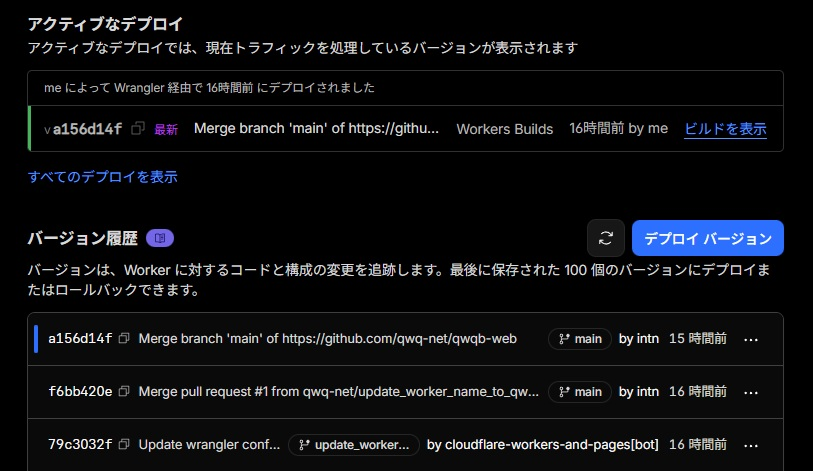
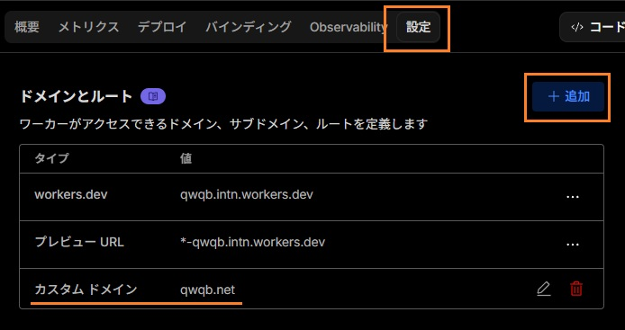
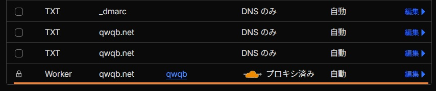

[Astro](https://astro.build/) の存在は元々知っていたものの、「アイランドアーキテクチャってやつね（分かってない）」という感じで割とスルー気味でした。実際のところ、静的サイトを構築するような案件を最近やっていないので触れる機会が無かったという面が強いです。そんな訳なので、ブログを作る形でしっかりと触ってみることにしました。

### 環境情報

- nvm: 0.40.1 (WSL環境で初めて開発しましたが、nvmで管理するのが快適っぽい)
- node.js: v24.13.0
- npm: 11.6.2
- astro: 5.16.15

### セットアップ

セットアップコマンドを実行し、ブログテンプレートを選択。イチから CSS を書いたりもしたくないので、とりあえず TailwindCSS も入れておきます。

```bash
npm create astro@latest
```

```bash
npx astro add tailwind --yes
```

Prettier も入れます。本当は Biome を入れたいですが、意外と面倒事が多いのでエコシステムに乗っかって楽したい時はやはり Prettier かなと最近は強く感じますね。

```bash
npm install --save-dev prettier prettier-plugin-astro prettier-plugin-tailwindcss prettier-plugin-organize-imports
```

適当にフォントも追加しておきます。パフォーマンスに大きく影響が出たら再検討するかもしれない……。

```bash
npm install @fontsource/ibm-plex-sans-jp @fontsource/ibm-plex-mono
```

記事ページ表示用に TailwindCSS の Typography も追加してから global.css 設定しておきます。

```bash
npm install @tailwindcss/typography
```

```css
@import "tailwindcss";
@plugin "@tailwindcss/typography";
```

codeblock などのセットアップも最初からされているようで、ここまで記述してきたコードも言語指定でシンタックスハイライトがされるようになっています。あとは不要なテンプレートファイルなどを削除すればこの時点でブログっぽく利用できてしまいます。

Astro ブログテンプレートの良いところは `content/` 配下でデータベースのように記事を管理できるところと、`content.config.ts` で、zod を使ったスキーマの定義が出来るところです。

例えばブログを書く上で、タグの表記揺れみたいなのを抑えてみたいなといったシーンで zod に検知させて型エラーにすることが出来ます。もちろん他にも色々なことが出来るはずです。

<details>
<summary>content.config.ts のサンプル</summary>

```ts
import { glob } from "astro/loaders";
import { defineCollection, z } from "astro:content";

// 使いそうなタグを定義しておく
const MAIN_GENRES = ["Blog", "Review", "Programming", "Study"] as const;
const LANGUAGES = ["TypeScript", "Golang", "Rust", "Kotlin"] as const;
const TOOLS = ["Blender", "Unity"] as const;
export const ALLOWED_TAGS = [...MAIN_GENRES, ...LANGUAGES, ...TOOLS] as const;

const blog = defineCollection({
  loader: glob({ base: "./src/content/blog", pattern: "**/*.{md,mdx}" }),
  schema: ({ image }) =>
    z.object({
      title: z.string(),
      description: z.string(),
      pubDate: z.coerce.date(),
      updatedDate: z.coerce.date().optional(),
      heroImage: image().optional(),
      tags: z.array(z.enum(ALLOWED_TAGS)).optional(), // 追加
    }),
});

export const collections = { blog };
```

</details>

例えば frontmatter に以下のようなタグを追記してみます。

```markdown
---
title: "hoge"
tags: ["Programming", "TypeScript", "fuga"]
---
```

このような時は、以下のようにエラーを出してくれます。

```plaintext
[ERROR] [InvalidContentEntryDataError] blog → create-astro-blog data does not match collection schema.
  tags.2**: **tags.2: Invalid enum value. Expected 'Programming' | 'TypeScript' ...中略... , received 'hoge'
```

画像に関しても自動的に最適化してくれるので、もはや静的サイトを作るうえですでにやることが有りません。本当にいい時代になったなぁと思いますね。

### Cloudflare 関連とデプロイ

Astro のプロジェクト内で以下のコマンドを実施し、 Cloudflare Adapter を追加します。特に手動で設定することはないです。

```bash
npx astro add cloudflare
```

続いて Cloudflare Pages のセットアップをすればデプロイ完了です。

1. Github 上にリポジトリを作成しておく（ここまでの作業内容は push しておく）
2. Cloudflare の[ダッシュボード](https://dash.cloudflare.com/)に移動
3. ビルド > コンピューティングとAI > Workers & Pages に移動
4. 右上のアプリケーションを作成するボタンを押下
5. Github を選択し、リポジトリを選択
6. あとは画面に従ってポチポチ

Workers & Pages の自身のプロジェクトを開き、デプロイから以下のようにデプロイ状況が確認できます。デプロイが完了すると pages 用のドメインが発行されて、そこからアクセスが可能になります。



カスタムドメインに関しても以下のように、自身のプロジェクトから設定を開き、カスタムドメインを選択した後に Cloudflare 上で所持しているドメインを入力するだけです。



DNSレコードへ自動的に設定され、本当に何もやることが無いです。すばらしい。



### さいごに

デザイン調整などを除けば殆ど作業することはありませんでした。万が一困っても今の時代は CopilotAgent などいくらでもサポートしてもらえる環境なので困ることはありませんね。

PageSpeed Insights も問題なく100点でした。


今回作成したプロジェクトは [こちら](https://github.com/qwq-net/qwqb-web) です。もし興味があって困ったことがあったら参考にしてください。
